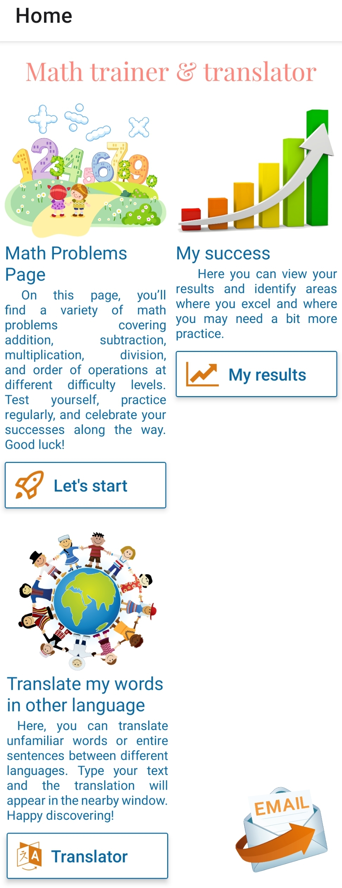

# Math trainer and translator
This mobile application is designed specifically for children, providing an interactive and engaging way to practice math skills. It also features a built-in translator, enabling quick translations of words or sentences across various languages to support learning and email functionality, allowing users to share progress with parents or peers, fostering communication and collaboration.

## A Clear and User-Friendly Interface
The interface is simple and intuitive, designed with calm colors to create a soothing environment. It’s easy enough for a child to navigate and ensures no distractions, helping users focus on completing tasks.
## 

## Structured Learning Approach
Mathematical problems are divided into 23 topics. For each topic, you solve 10 examples. Once completed, the program checks your answers. If all answers are correct, a fun animation appears as a reward. If there are mistakes, the program highlights the errors and displays the correct answers.
## 

&nbsp&nbsp

## Track Your Progress
You can monitor your progress on the results page, which stores information about completed tasks. Additionally, each topic has its own detailed results displayed through interactive graphs for a comprehensive overview.
## 

  
&nbsp&nbsp    
 

## Built-In Dictionary
A dedicated dictionary function allows quick translation of words or sentences across various languages, making learning seamless and efficient.
## 

## Focused and Effective Design
All features are practical and relevant—nothing unnecessary, only tools to support your success!

## Tech Stack
1. Programming Languages
-	JavaScript
2. Frameworks and Libraries
-	React Native (for mobile app development)
-	Expo (for rapid prototyping and development)
3. Database
-	SQLite (for local data storage)
4. APIs
-	Giphy API (for GIFs and animations)
-	MyMemory API (for translation services)
5. Version Control
-	GitHub (for code hosting and collaboration)
6. Development Environment
-	Visual Studio Code (primary IDE)
-	Android Studio (for Android emulation and debugging)
-	Node.js (JavaScript runtime for development)
7. Specialized Tools
-	Animations: Giphy (for GIF-based animations)
-	UI Components: React Native Elements, React Native Ratings
-	Data Visualization: Gifted Charts
-	Image Resources: Pngegg
